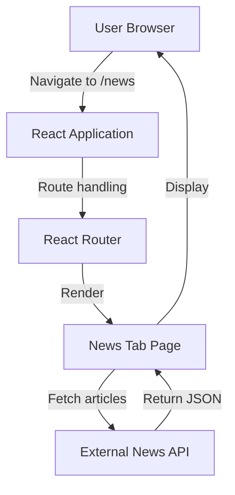
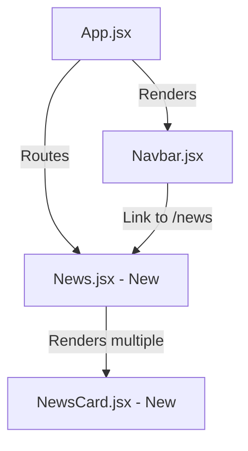

# Design Document: News Tab Feature

## Overview

The News Tab feature adds a dedicated news section to the Mutual Fund Analyzer application, providing users with real-time access to mutual fund and investment-related news articles. This feature integrates with an external news API to fetch, display, and manage news content in a user-friendly interface that maintains consistency with the existing application design.

### Design Goals

1. **Seamless Integration**: Add news functionality without disrupting existing application structure
2. **User Experience**: Provide clear loading, error, and empty states for all API interactions
3. **Responsive Design**: Ensure the news feed works well across all device sizes
4. **Performance**: Lazy-load news data only when the News Tab is visited
5. **Maintainability**: Create reusable components that follow existing project patterns

### Key Design Decisions

**Decision 1: News API Selection**
- **Choice**: Use NewsAPI.org or GNews API for news aggregation
- **Rationale**: Both provide free tiers, good documentation, and support keyword-based searches. NewsAPI offers better filtering but has stricter rate limits. GNews provides simpler integration with fewer restrictions.
- **Trade-off**: Free tier limitations may require implementing rate limiting UI feedback

**Decision 2: State Management**
- **Choice**: Use React useState and useEffect hooks (consistent with existing codebase)
- **Rationale**: The application already uses this pattern throughout (see Home.jsx, App.jsx). No need to introduce Redux or Context API for this isolated feature.
- **Trade-off**: Cannot easily share news state across components, but this feature is self-contained

**Decision 3: Component Structure**
- **Choice**: Create dedicated News page component with child NewsCard components
- **Rationale**: Follows the existing pattern (Home, Portfolio, Compare, Calculator pages)
- **Trade-off**: Cannot display news in multiple locations without prop drilling

**Decision 4: Date Formatting**
- **Choice**: Implement relative time formatting ("2 hours ago", "Yesterday")
- **Rationale**: Improves readability and provides better context for article recency
- **Trade-off**: Requires additional utility function and periodic re-rendering for accuracy

## Architecture

### System Context



### Component Hierarchy



### Routing Integration

The feature integrates into the existing React Router setup in `App.jsx`:

```javascript
// Add to existing Routes in App.jsx
<Route path="/news" element={<News />} />
```

The Navbar component will be updated to include the News link positioned after Calculator.

## Components and Interfaces

### 1. News Page Component (`News.jsx`)

**Purpose**: Main container component that manages news fetching, state, and rendering

**State Management**:
```javascript
const [articles, setArticles] = useState([])
const [loading, setLoading] = useState(true)
const [error, setError] = useState(null)
```

**Lifecycle**:
1. Component mounts → Trigger initial fetch
2. Fetch begins → Set loading to true
3. Fetch succeeds → Store articles, set loading to false
4. Fetch fails → Retry once after 2 seconds
5. Retry fails → Set error state, display error UI

**Component Interface**:
```javascript
function News() {
  // State
  const [articles, setArticles] = useState([])
  const [loading, setLoading] = useState(true)
  const [error, setError] = useState(null)
  
  // Effects
  useEffect(() => {
    fetchNews()
  }, [])
  
  // Methods
  const fetchNews = async () => { /* ... */ }
  const handleRetry = () => { /* ... */ }
  
  // Render logic based on state
  if (loading) return <LoadingState />
  if (error) return <ErrorState onRetry={handleRetry} />
  if (articles.length === 0) return <EmptyState />
  return <NewsFeed articles={articles} />
}
```

### 2. NewsCard Component (`NewsCard.jsx`)

**Purpose**: Reusable card component to display individual news articles

**Props Interface**:
```javascript
interface NewsCardProps {
  article: {
    title: string
    description: string
    source: string
    publishedAt: string (ISO 8601 format)
    url: string
    urlToImage: string
  }
}
```

**Rendering Behavior**:
- Title: Truncate to 2 lines with ellipsis using CSS
- Description: Truncate to 3 lines with ellipsis
- Date: Convert ISO 8601 to relative time format
- Image: Display with fallback for missing images
- Link: Open in new tab with security attributes

**Styling Requirements**:
- Dark background matching existing app theme (#111827)
- Border: 1px solid #333
- Border radius: 16px
- Hover effect: Scale transform or border color change
- Responsive padding: 20px on mobile, 24px on desktop

### 3. News Service (`newsService.js`)

**Purpose**: Encapsulate all news API logic and data transformation

**Module Interface**:
```javascript
// newsService.js
export async function fetchMutualFundNews(apiKey) {
  // Returns: { articles: Article[], error: string | null }
}

export function transformNewsResponse(apiResponse) {
  // Transforms API response to application format
}
```

**API Request Structure** (NewsAPI example):
```javascript
const url = `https://newsapi.org/v2/everything?` +
  `q=mutual funds OR investment OR stock market&` +
  `language=en&` +
  `sortBy=publishedAt&` +
  `pageSize=20&` +
  `apiKey=${apiKey}`
```

**Error Handling**:
- Network errors → Retry logic in News component
- API errors (401, 429) → Display specific error messages
- No results → Return empty array (triggers Empty State)

### 4. Utility Functions

**Date Formatter** (`utils/formatDate.js`):
```javascript
export function formatRelativeTime(isoDate) {
  const date = new Date(isoDate)
  const now = new Date()
  const diffMs = now - date
  const diffMins = Math.floor(diffMs / 60000)
  const diffHours = Math.floor(diffMs / 3600000)
  const diffDays = Math.floor(diffMs / 86400000)
  
  if (diffMins < 60) return `${diffMins} minutes ago`
  if (diffHours < 24) return `${diffHours} hours ago`
  if (diffDays === 1) return 'Yesterday'
  if (diffDays < 7) return `${diffDays} days ago`
  
  return date.toLocaleDateString('en-US', { 
    month: 'short', 
    day: 'numeric', 
    year: 'numeric' 
  })
}
```

## Data Models

### Article Data Structure

```javascript
// Internal application format
{
  id: string,              // Unique identifier (generated from URL hash)
  title: string,           // Article headline
  description: string,     // Article summary/excerpt
  source: string,          // Publisher name
  publishedAt: string,     // ISO 8601 date string
  url: string,             // Link to full article
  urlToImage: string,      // Thumbnail image URL
}
```

### API Response Mapping

**NewsAPI Response → Application Format**:
```javascript
// NewsAPI response structure
{
  articles: [
    {
      source: { id: string, name: string },
      author: string,
      title: string,
      description: string,
      url: string,
      urlToImage: string,
      publishedAt: string,
      content: string
    }
  ]
}

// Transform to internal format
articles.map(article => ({
  id: generateHash(article.url),
  title: article.title,
  description: article.description || 'No description available',
  source: article.source.name,
  publishedAt: article.publishedAt,
  url: article.url,
  urlToImage: article.urlToImage || '/placeholder-news.png'
}))
```

## Error Handling

### Error States and User Feedback

**1. Network Errors**
- **Scenario**: Fetch request fails due to connectivity issues
- **User Message**: "Unable to load news. Please check your internet connection."
- **Action**: Show "Retry" button
- **Implementation**: Automatic retry after 2 seconds, then manual retry option

**2. API Authentication Errors (401)**
- **Scenario**: Invalid or missing API key
- **User Message**: "News service is temporarily unavailable. Please try again later."
- **Action**: Show "Retry" button (will fail again, but provides consistency)
- **Developer Note**: Log error to console for debugging

**3. Rate Limiting (429)**
- **Scenario**: Exceeded API rate limits
- **User Message**: "News service limit reached. Please try again in a few minutes."
- **Action**: Disable retry button for 60 seconds
- **Implementation**: Store timestamp of 429 error, check before allowing retry

**4. Empty Results**
- **Scenario**: API returns 0 articles
- **User Message**: "No news articles available at this time. Check back later!"
- **Action**: No action required (informational)
- **Implementation**: Display EmptyState component with friendly icon

**5. Malformed API Response**
- **Scenario**: API returns unexpected data structure
- **User Message**: "Failed to load news articles. Please try again."
- **Action**: Show "Retry" button
- **Implementation**: Validate response structure before processing

### Error Recovery Strategy

```javascript
async function fetchNews(retryCount = 0) {
  try {
    setLoading(true)
    setError(null)
    
    const response = await fetch(apiUrl)
    
    if (!response.ok) {
      throw new Error(`HTTP ${response.status}`)
    }
    
    const data = await response.json()
    const transformed = transformNewsResponse(data)
    
    setArticles(transformed)
    setLoading(false)
    
  } catch (err) {
    if (retryCount < 1) {
      // Retry once after 2 seconds
      setTimeout(() => fetchNews(retryCount + 1), 2000)
    } else {
      setError(err.message)
      setLoading(false)
    }
  }
}
```

## Testing Strategy

### Testing Approach

This feature involves UI rendering, external API calls, and browser interactions, which are **not suitable for property-based testing**. The testing strategy will focus on:

1. **Unit Tests**: Test isolated functions and component logic
2. **Integration Tests**: Test component interactions and API integration
3. **Manual Testing**: Test UI/UX, responsive design, and user interactions

### Unit Tests

**Target**: Utility functions and data transformations

**Test Cases**:

1. **Date Formatting** (`formatRelativeTime`)
   - Input: Current timestamp → Output: "just now" or "0 minutes ago"
   - Input: 2 hours ago → Output: "2 hours ago"
   - Input: Yesterday → Output: "Yesterday"
   - Input: 5 days ago → Output: "5 days ago"
   - Input: 2 weeks ago → Output: "Jan 1, 2024" (formatted date)

2. **API Response Transformation** (`transformNewsResponse`)
   - Input: Valid NewsAPI response → Output: Array of article objects
   - Input: Response with missing descriptions → Output: "No description available"
   - Input: Response with missing images → Output: Placeholder image path
   - Input: Empty articles array → Output: Empty array
   - Input: Malformed response → Output: Empty array or throw error

3. **URL Hash Generation** (for article IDs)
   - Input: Same URL → Output: Same hash (idempotent)
   - Input: Different URLs → Output: Different hashes (unique)

**Testing Library**: Jest (standard React testing tool)

**Example Test**:
```javascript
describe('formatRelativeTime', () => {
  it('returns "2 hours ago" for timestamps 2 hours in the past', () => {
    const twoHoursAgo = new Date(Date.now() - 2 * 3600000).toISOString()
    expect(formatRelativeTime(twoHoursAgo)).toBe('2 hours ago')
  })
  
  it('returns "Yesterday" for timestamps from yesterday', () => {
    const yesterday = new Date(Date.now() - 86400000).toISOString()
    expect(formatRelativeTime(yesterday)).toBe('Yesterday')
  })
})
```

### Integration Tests

**Target**: Component rendering and API interaction

**Test Cases**:

1. **News Component Loading State**
   - Verify loading spinner displays on mount
   - Verify loading text is present
   - Verify no articles are rendered during loading

2. **News Component Success State**
   - Mock successful API response
   - Verify articles are rendered as NewsCard components
   - Verify correct number of articles displayed
   - Verify loading state is removed

3. **News Component Error State**
   - Mock failed API response
   - Verify error message displays
   - Verify retry button is present
   - Verify clicking retry triggers new API call

4. **News Component Empty State**
   - Mock API response with 0 articles
   - Verify empty state message displays
   - Verify no error or loading states are shown

5. **NewsCard Rendering**
   - Verify all article data renders correctly
   - Verify external link has correct attributes (target, rel)
   - Verify click handler opens link in new tab
   - Verify image fallback for missing images

6. **Navbar Integration**
   - Verify "News" link is present in Navbar
   - Verify clicking "News" navigates to /news route
   - Verify active styling applies when on /news route

**Testing Library**: React Testing Library + Jest

**Example Test**:
```javascript
import { render, screen, waitFor } from '@testing-library/react'
import { BrowserRouter } from 'react-router-dom'
import News from '../pages/News'

describe('News Component', () => {
  it('displays loading state initially', () => {
    render(
      <BrowserRouter>
        <News />
      </BrowserRouter>
    )
    
    expect(screen.getByText(/loading news/i)).toBeInTheDocument()
  })
  
  it('displays articles after successful fetch', async () => {
    global.fetch = jest.fn(() =>
      Promise.resolve({
        ok: true,
        json: () => Promise.resolve({
          articles: [
            {
              title: 'Test Article',
              description: 'Test description',
              source: { name: 'Test Source' },
              url: 'https://example.com',
              urlToImage: 'https://example.com/image.jpg',
              publishedAt: '2024-01-01T00:00:00Z'
            }
          ]
        })
      })
    )
    
    render(<BrowserRouter><News /></BrowserRouter>)
    
    await waitFor(() => {
      expect(screen.getByText('Test Article')).toBeInTheDocument()
    })
  })
})
```

### Manual Testing Checklist

**Responsive Design**:
- [ ] Test on mobile (< 768px): 1 column layout
- [ ] Test on tablet (768-1024px): 2 column layout
- [ ] Test on desktop (> 1024px): 3 column layout
- [ ] Verify cards resize proportionally
- [ ] Check text truncation on all screen sizes

**User Interactions**:
- [ ] Click news card → Opens in new tab
- [ ] Click retry button → Fetches news again
- [ ] Navigate to /news via navbar → Page loads correctly
- [ ] Refresh page on /news → Page reloads and fetches news
- [ ] Active navbar styling applies correctly

**API Integration**:
- [ ] Valid API key → Articles load successfully
- [ ] Invalid API key → Error state displays
- [ ] Network disconnect → Error state displays
- [ ] Network reconnect + retry → Articles load
- [ ] Empty results → Empty state displays

**Accessibility**:
- [ ] Tab navigation works through all clickable elements
- [ ] Screen reader announces loading states
- [ ] Links have descriptive text
- [ ] Images have alt text
- [ ] Color contrast meets WCAG standards

### Test Configuration

**Setup Required**:
1. Install testing dependencies (if not present):
   ```bash
   npm install --save-dev @testing-library/react @testing-library/jest-dom jest
   ```

2. Create test files:
   - `src/utils/__tests__/formatDate.test.js`
   - `src/services/__tests__/newsService.test.js`
   - `src/pages/__tests__/News.test.jsx`
   - `src/Components/__tests__/NewsCard.test.jsx`

3. Add test script to package.json:
   ```json
   {
     "scripts": {
       "test": "jest",
       "test:watch": "jest --watch"
     }
   }
   ```

### Test Coverage Goals

- **Utility Functions**: 100% coverage (pure functions, easy to test)
- **Service Functions**: 90% coverage (API integration, mock responses)
- **React Components**: 70% coverage (focus on logic, not JSX structure)
- **Integration Tests**: Cover all user flows and error scenarios

## Implementation Notes

### Environment Variables

Store the API key securely using Vite's environment variable system:

**`.env` file** (add to .gitignore):
```
VITE_NEWS_API_KEY=your_api_key_here
```

**Usage in code**:
```javascript
const apiKey = import.meta.env.VITE_NEWS_API_KEY
```

### Responsive Grid Implementation

Use CSS Grid with media queries matching existing application patterns:

```css
.news-grid {
  display: grid;
  gap: 24px;
  padding: 40px 25px;
}

/* Mobile: 1 column */
@media (max-width: 767px) {
  .news-grid {
    grid-template-columns: 1fr;
  }
}

/* Tablet: 2 columns */
@media (min-width: 768px) and (max-width: 1024px) {
  .news-grid {
    grid-template-columns: repeat(2, 1fr);
  }
}

/* Desktop: 3 columns */
@media (min-width: 1025px) {
  .news-grid {
    grid-template-columns: repeat(3, 1fr);
  }
}
```

### Text Truncation

Use CSS for multi-line text truncation:

```css
.news-card-title {
  display: -webkit-box;
  -webkit-line-clamp: 2;
  -webkit-box-orient: vertical;
  overflow: hidden;
  text-overflow: ellipsis;
}

.news-card-description {
  display: -webkit-box;
  -webkit-line-clamp: 3;
  -webkit-box-orient: vertical;
  overflow: hidden;
  text-overflow: ellipsis;
}
```

### Performance Considerations

1. **Lazy Loading**: News is only fetched when the user navigates to /news (not on app startup)
2. **Image Optimization**: Use `loading="lazy"` attribute on images
3. **Debouncing**: If implementing search, debounce user input (500ms delay)
4. **Caching**: Consider caching articles in sessionStorage for 5-10 minutes to reduce API calls

### Security Considerations

1. **External Links**: Always use `rel="noopener noreferrer"` with `target="_blank"`
2. **API Key Protection**: Store in environment variables, never commit to version control
3. **XSS Prevention**: React automatically escapes strings, but be cautious with dangerouslySetInnerHTML
4. **Content Security Policy**: Ensure CSP allows loading images from news API domains

## File Structure

```
src/
├── pages/
│   └── News.jsx                    # New: Main news page component
├── Components/
│   └── NewsCard.jsx                # New: Individual news card component
│   └── Navbar.jsx                  # Modified: Add News link
├── services/
│   └── newsService.js              # New: News API integration
├── utils/
│   └── formatDate.js               # New: Date formatting utility
├── styles/
│   └── newsStyles.js               # New: Inline styles for news components
└── App.jsx                         # Modified: Add /news route
```

## Dependencies

**No new dependencies required**. The feature uses existing packages:
- `react`: Component creation
- `react-router-dom`: Routing
- `react-icons`: Icons for loading/error states (already installed)

Optional: Consider adding `date-fns` or `dayjs` for more robust date formatting, but native JavaScript Date methods are sufficient for this use case.

## Migration and Rollout

### Implementation Steps

1. **Phase 1: Service Layer**
   - Create `newsService.js` with API integration
   - Create `formatDate.js` utility
   - Write unit tests for both

2. **Phase 2: Components**
   - Create `NewsCard.jsx` component
   - Create `News.jsx` page component
   - Create `newsStyles.js` styling

3. **Phase 3: Integration**
   - Update `Navbar.jsx` to add News link
   - Update `App.jsx` to add /news route
   - Test navigation flow

4. **Phase 4: Testing**
   - Write integration tests
   - Perform manual testing across devices
   - Test error scenarios

5. **Phase 5: Deployment**
   - Add API key to environment variables
   - Deploy to staging environment
   - Verify in production-like settings

### Rollback Plan

If issues arise, the feature can be rolled back by:
1. Removing the `/news` route from `App.jsx`
2. Removing the News link from `Navbar.jsx`
3. Deleting new files (News.jsx, NewsCard.jsx, newsService.js)

The rollback is clean because:
- No existing components are modified significantly
- No database or state changes
- No breaking changes to other features

## Future Enhancements

**Post-MVP Improvements**:
1. **Search Filtering**: Allow users to filter news by keywords or categories
2. **Bookmarking**: Save favorite articles to local storage
3. **Pagination**: Load more articles on scroll or button click
4. **Personalization**: Track user interests and show relevant news
5. **Notifications**: Alert users to breaking news or important updates
6. **Share Functionality**: Share articles via social media or email
7. **Dark/Light Mode Toggle**: Respect user's theme preference
8. **Offline Support**: Cache articles for offline reading

**Technical Debt to Address**:
- Consider implementing React Query for better data fetching and caching
- Explore infinite scroll for better UX on long lists
- Add analytics to track which articles users click
